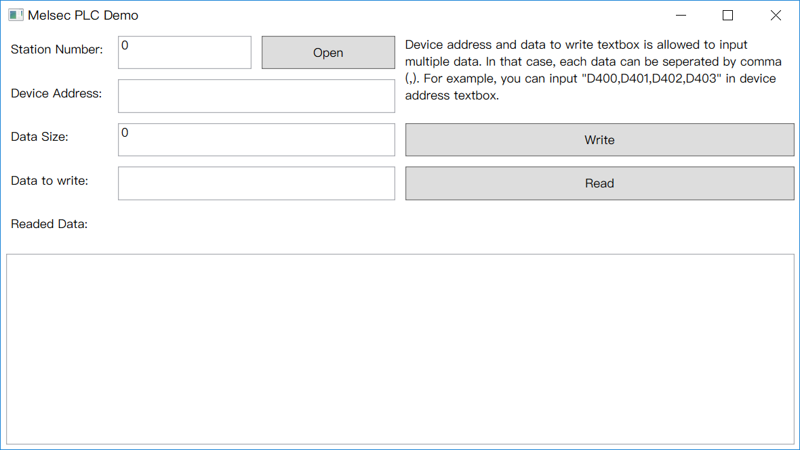

## PlcLib

����һ������PLC������Ŀ⣬Ŀǰ�Ѿ�ʵ�ֵ�������PLC�IJ�����

This is a library including some PLC operation classes, but only MelsecPLC class can be used.

## PlcLib.Test

������������PlcLib����Ŀ��

This is a project to test PlcLib.

## MelsecPLC.Test

����һ����������PLC����ͨ�ŵ�WPF��Ŀ����ʹ��֮ǰ��Ҫȷ��PLC�豸�Ѿ�ʹ��MELSOFT�ٷ��ṩ��Communication Setup Utility���߷����վ��š�

This is a WPF project to test Melsec PLC communication with serial port. Before using, You must make sure set a station number to PLC device with
a tool named Communication Setup Utility, which is supported by MELSOFT official.

