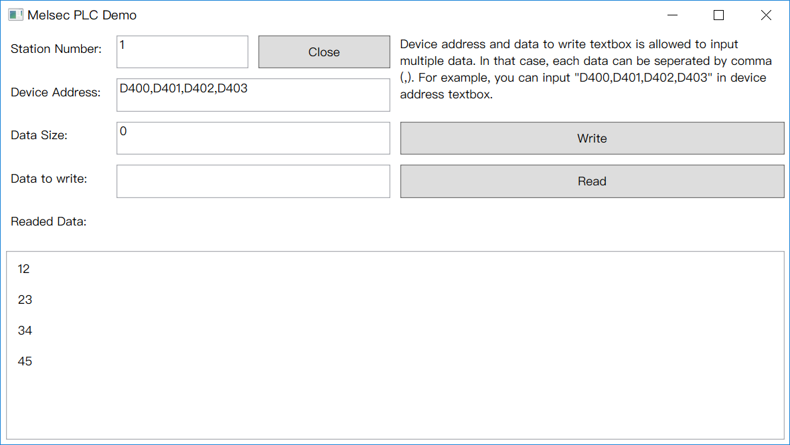

## PlcCommunication

这是一个包含PLC操作类的库，目前已经实现的是三菱PLC的操作。

This is a library including some PLC operation classes, but only MelsecPLC class can be used.

## PlcLib.Test

这是用来测试PlcLib的项目。

This is a project to test PlcLib.

## MelsecPLCDemo

这是一个测试三菱PLC串口通信的WPF项目，在使用之前需要安装MELSOFT官方提供的MX Component组件，并确保PLC设备已经使用Communication Setup Utility工具分配好站点号和串口。

This is a WPF project to test Melsec PLC communication with serial port. Before using, You must make sure that MX Component is installed in your computer 
and set PLC device with Communication Setup Utility, which is supported by MELSOFT official.

## PLCConfigFileGenerator

配置文件编辑器。

This is a config file editor.